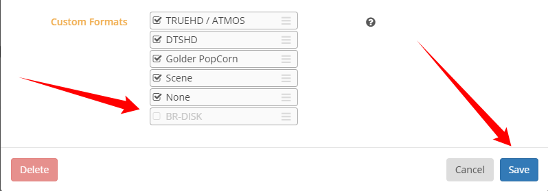
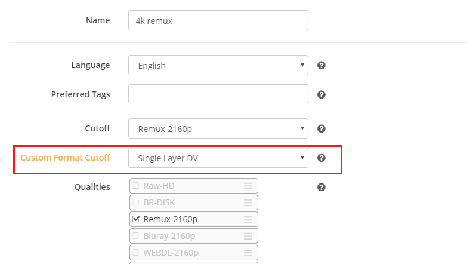

# Collection of Custom Formats

## Dolby TrueHD/ATMOS

> Dolby TrueHD/ATMOS = `C_RXRQ_TRUEHD|ATMOS`

If you prefer TrueHD|Atmos audio tracks.

!!! note
    To make this workable you need to put it in a order to what you prefer and above `none`.

> 

------

## DTS-HD DTS-X

> DTS-HD/DTS:X = `C_RXRQ_DTS.?(HD|ES|X(?!\d))`

If you prefer DTS-HD audio tracks.

!!! note
    To make this workable you need to put it in a order to what you prefer and above `none`.

> 

------

## BR-DISK

> BR-DISK = `C_RXRQ_(AVC|VC-1|HEVC)` `M_N_REMUX` `S_N_WEBDL` `C_RXRQ_^((?!x265).)*$`

If you don't want BR-DISK (Iso's and Blu-ray folder structure).

!!! note
    To make this workable you need to uncheck it in your profile

> 

------

## x264

> x264 = `C_RX_(X|H)\.?264`

If you prefer x264 releases (Encodes).

------

## x265

> x265 = `C_RX_(X|H)\.?265`

If you prefer x265 releases (Encodes/Re-Encodes).
Why isn't HEVC added in this CF?

* HEVC is officially only used for untouched sources, but most x265 Encoders/Re-Encoders mix them in the release name because they don't know better or think they do.
* I didn't add it because this would also mean that BR-DISK/Remux is a x265 and those are untouched sources so never are x265.

Luckily most x265 Encoders/Re-Encoders also add x265 so it get's picked up correctly.

------

## EVO except WEB-DL

> EVO (except WEB-DL) = `C_RX_\B(-EVO)\B` `S_N_WEBDL`

This group is often banned for the low quality Blu-ray releases but their WEB-DL are okay.

!!! note
    To make this workable you need to uncheck it in your profile

> 

------

## Single Layer DV

> Single Layer DV = `C_RXRQ_SL.?DV|Single.?Layer.?DoVi` `M_RQ_REMUX`

If you prefer Dolby Vision Video's you now can use Single layer Dolby Vision what seems to works in Plex on the Shield.... The Double layer's only tend to work on smart tv's.

!!! note
    To make this workable you need to check this in your profile and put it on top of the others you got !!!

> 

!!! note
    And also make sure you set it as `Custom Format Cutoff`

> 
