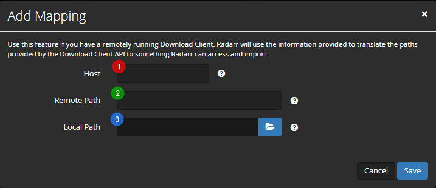
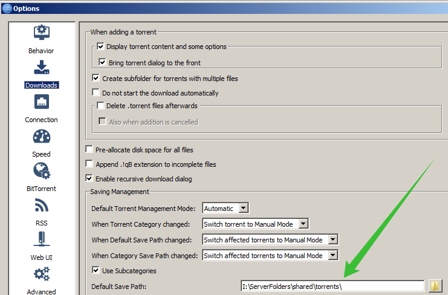
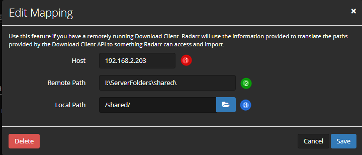

# Remote Path Mappings explained

Seems that allot of people don't understand how the remote path mapping works for Radarr.
I will try to explain it with some screenshots and a short description,

## Do I need Remote Path Mappings

If your download client is on another system then Radarr then you probably need to make use of Remote Path Mappings.

You will get a error that looks a little bit like the following screenshot.

So looking at this screenshot it seems we need to make use of Remote Path Mappings

## How

First we navigate in Radarr to the Settings => `Download Client` Tab.

At the bottom you choose `Add new mapping`

A screen will popup with the following options.

1. `Host` => This is the hostname or IP you set in your download client settings.
1. `Remote Path` => The download path that you've set in your download client.
1. `Local Path` => The path Sonarr/Radarr needs to access the same path.

??? example "Examples"

    === "QBittorrent"

        ## Host

        To find what you need to put in your host you navigate in Radarr to the Settings => Download Client Tab.
        There you open up the download client for this example I will be using QBittorrent

        

        This is what you put in your Host in Remote Path Mapping.

        ## Remote Path

        To find what you need to put in your remote path you need to open up your download client and look what you've used there as download location.

        In QBittorrent navigate to Tools => Options (or ALT+O) and navigate to the Download settings.

        

        This is what you add in your Remote Path in Remote Path Mapping.

        ## Local Path

        To find what you need to put in in your local path you need to know how Radarr is able to access the files your download client downloaded.
        And this can be done in different ways.
        Mounting/Network share what ever but Radarr needs to have local access to it so you need to figure this one out your self what's the best way for Radarr to access the download clients downloaded files.

        The final result will look something like this.

        
